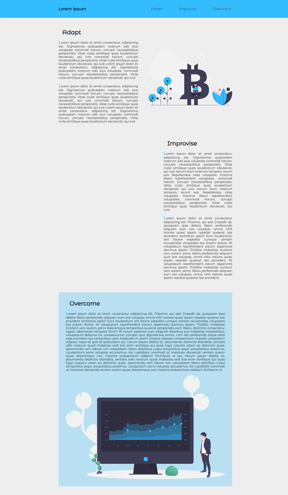

# 🌟 Scroll Popup

## 📋 Description

Landing page avec animations JavaScript basées sur le scroll. Démonstration de manipulation DOM et d'animations fluides.

Visitez la page: https://projetsdevfanny.github.io/TP3_FromScratch_Scroll_popup_JS_Vanilla/

## ✨ Fonctionnalités

- **Navbar dynamique** : Se réduit au scroll (10vh → 4vh)
- **Animation Nakamoto** : Apparition progressive avec translation adaptative
- **Popup newsletter** : Apparition à 80% du scroll
- **Design responsive** : Adaptation mobile/desktop

## 🛠️ Technologies

- **HTML5** : Structure sémantique
- **CSS3** : Variables CSS, Grid, animations
- **JavaScript Vanilla** : Event listeners, manipulation DOM

## 🚀 Code Clé

### Translation Adaptatif

```javascript
let translation =
  window.innerWidth < 768 ? "30vw" : `${Math.min(50, window.innerWidth / 2)}px`;
```

### Scroll Ratio

```javascript
let scrollValue =
  (window.scrollY + window.innerHeight) / document.body.offsetHeight;
```

## 🎯 Compétences Démontrées

- **JavaScript avancé** : Gestion d'événements scroll, calculs mathématiques
- **CSS moderne** : Variables, Grid, animations fluides
- **UX/UI** : Micro-interactions, design responsive
- **Performance** : Optimisation des animations

## 📸 Captures d'Écran

### Scroll Up (Navbar étendue)



### Scroll Down (Navbar réduite + Popup)

[Voir l'image Scroll Down](./ScreenShot_ScrollPopup_Scroll_down.png)

## 🚀 Utilisation

1. Ouvrez `index.html`
2. Faites défiler pour voir les animations

---

